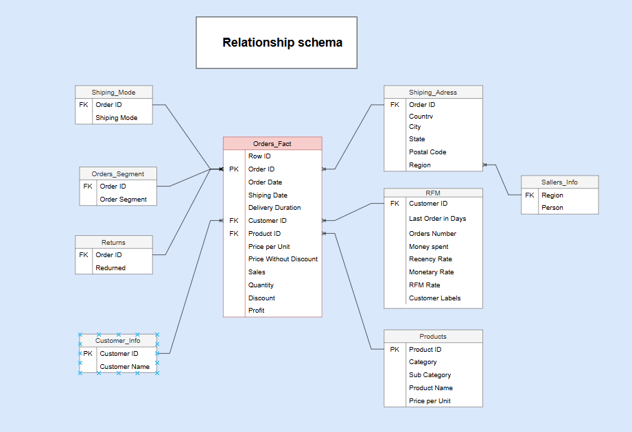

# Sales Analysis Project

## Overview

This project is an interactive Excel dashboard designed to analyze sales performance, product returns, and delivery efficiency. It is built using raw order and return data and includes visualizations, KPIs, and dynamic filters.
---

## 📷 Data Structure

## 📁 Excel Data Model Structure

This Excel file contains multiple structured tables derived from raw order and return data. The tables are designed for analysis, segmentation, and reporting using formulas such as `INDEX-MATCH`, `COUNTIFS`, and `MAXIFS`.
---

### 🧾 1. Orders_Fact

Fact table built from the main `Orders` source. Includes:

- `Row ID`
- `Order ID`
- `Order Date`
- `Shipping Date`
- `Delivery Duration`
- `Price per Unit`
- `Price Without Discount`
- `Customer ID`
- `Product ID`
- `Sales`
- `Quantity`
- `Discount`
- `Profit`

---

### 👤 2. Customers_Info

Customer dimension table containing:

- Unique `Customer ID`
- `Customer Name`

---

### 📦 3. Orders_Segment

Created via `INDEX-MATCH` from the `Orders` table. Includes:

- Unique `Order ID`
- `Order Segment` (Consumer, Home Office, Corporate)

---

### 🚚 4. Ships_Mode

Shipping mode table created via `INDEX-MATCH` from the `Orders` table:

- Unique `Order ID`
- `Ship Mode` (First Class, Second Class, Standard Class, Same Day)

---

### 🛍 5. Product

Product dimension table created via `INDEX-MATCH` from the `Orders` table:

- Unique `Product ID`
- `Category`
- `Sub-Category`
- `Product Name`
- `Price per Unit`  
  > - If `Discount = 0`: `Sales / Quantity`  
  > - If `Discount > 0`: `Sales / (1 - Discount) / Quantity`

---

### 📊 6. RFM

Customer-level RFM (Recency, Frequency, Monetary) segmentation table:

- `Customer ID` (unique)
- `Last Order in Days` → `MAXIFS` from `Order Date`
- `Number of Orders` → `COUNTIFS` from `Order ID`
- `Money Spent` → `SUMIFS` from `Sales`
- `Recency Rate` → Percentile rank `Last Order in Days` column divided into 5 bins (lower value = 5, higher = 1)
- `Frequency Rate` → Percentile rank `Number of Orders` column divided into 5 bins (lower = 1, higher = 5)
- `Monetary Rate` → Percentile rank `Money Spent` column divided into 5 bins (lower = 1, higher = 5)
- `RFM Score` → Concatenated value: `Recency + Frequency + Monetary`
- `Customer Labels` → Labels assigned based on `RFM Score`

---

### 🔁 7. Returns

Table indicating product returns, based on original sources. Include only Order ID Returned items:

- `Order ID`
- `Returned` 

---

### 🧑‍💼 8. Sellers_Info

Renamed from the original `People` table:

- `Person`
- `Region`

---

### 🏠 9. Shipping_Address

Address-level details extracted via `INDEX-MATCH` from the `Orders` table:

- Unique `Order ID`
- `Country`
- `City`
- `State`
- `Postal Code`
- `Region`

---

